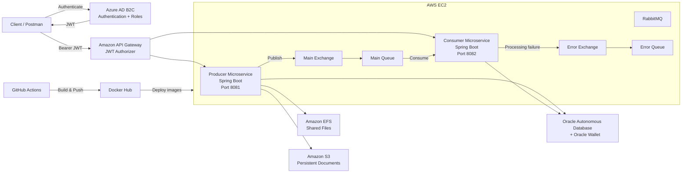

# Gestión de Guías de Despacho

Cloud-native backend system for managing dispatch guides through a distributed microservice architecture built with **Java 17 and Spring Boot 3.5.16**.

The solution integrates asynchronous messaging, relational persistence, shared and object storage, OAuth2/JWT security, containerization and automated cloud deployment.

> Microservices • Cloud • Messaging • Security • CI/CD

---

## 📌 Overview

**Gestión de Guías de Despacho** is an academic cloud-native project designed around two independent Spring Boot microservices:

- **Producer service** — receives and manages dispatch guide operations, generates documents and publishes messages to RabbitMQ.
- **Consumer service** — consumes queued messages, validates and processes dispatch guides, persists processing results and manages failed messages.

The solution integrates:

- Java 17
- Spring Boot 3.5.16
- Spring Security
- OAuth2 Resource Server
- Azure AD B2C
- JWT-based authorization
- RabbitMQ
- Oracle Autonomous Database
- Oracle Wallet
- AWS EC2
- Amazon API Gateway
- Amazon EFS
- Amazon S3
- Docker
- Docker Compose
- Docker Hub
- GitHub Actions
- Swagger / OpenAPI
- Spring Boot Actuator

The project focuses on **service decoupling, asynchronous processing, cloud infrastructure, secure API access and automated delivery**.

---

## 🏗️ Architecture

The solution follows a distributed producer-consumer architecture.



**Amazon API Gateway** was used as the centralized public entry point for both services, while Azure AD B2C provided JWT-based identity and authorization.

---

## 🧩 Microservices

### 🚚 Producer

The producer runs on:

```text
8081
```

Its responsibilities include:

- Receiving HTTP requests
- Publishing dispatch guides to RabbitMQ
- Querying persisted guides
- Updating guides
- Deleting guides
- Generating dispatch-guide documents
- Writing generated files to the EFS-mounted filesystem
- Uploading documents to Amazon S3
- Downloading documents from S3
- Monitoring RabbitMQ queue state
- Exposing health and monitoring endpoints

Main package:

```text
src/main/java/com/duoc/gestionguiasdespacho
```

---

### 📦 Consumer

The consumer is maintained as a second Spring Boot application inside the same repository:

```text
gestionguias_consumidor/
```

It runs on:

```text
8082
```

Its responsibilities include:

- Reading dispatch-guide messages from RabbitMQ
- Validating received messages
- Processing guide information
- Persisting processing results in Oracle
- Detecting duplicate messages through `messageId`
- Recording processing errors
- Publishing failed messages to the error topology
- Querying processed messages
- Exposing an independent health endpoint

The current implementation performs consumption on demand through:

```text
POST /api/guias/cola/consumir
```

rather than using an automatic listener.

---

## 📨 RabbitMQ

RabbitMQ decouples request publication from later guide processing.

### Main Messaging Topology

```text
Exchange:
guias.despacho.exchange

Routing Key:
guias.despacho

Queue:
guias.despacho.queue
```

The main queue is durable and configured with the error exchange as its dead-letter destination.

### Error Topology

```text
Exchange:
guias.despacho.error.exchange

Routing Key:
guias.despacho.error

Queue:
guias.despacho.error.queue
```

Failed messages can be:

- Recorded in Oracle
- Enriched with error information
- Forwarded to the dedicated error exchange
- Stored in the error queue for inspection

Messages are published as persistent RabbitMQ messages and receive a unique `messageId`.

### RabbitMQ Ports

```text
5672  → AMQP
15672 → RabbitMQ Management
```

---

## 🔁 Message Processing

The general processing flow is:

```text
POST /api/guias
        │
        ▼
Producer
        │
        ├── Generate messageId
        │
        ▼
RabbitMQ Main Exchange
        │
        ▼
Main Queue
        │
        ▼
POST /api/guias/cola/consumir
        │
        ▼
Consumer
        │
        ├── Validate message
        ├── Check messageId
        ├── Process guide
        └── Persist result
                │
                ▼
       Oracle Autonomous DB
```

When processing fails:

```text
Consumer
   │
   ├── Register error in Oracle
   │
   ▼
Error Exchange
   │
   ▼
Error Queue
```

The `messageId` is stored with a unique constraint, helping prevent duplicate processing of the same RabbitMQ message.

---

## 🗄️ Oracle Autonomous Database

Oracle Autonomous Database provides persistence for both operational and asynchronous processing information.

Connection is performed through **Oracle Wallet**.

### `GUIAS_DESPACHO`

Stores the operational dispatch-guide information, including:

- Guide number
- Carrier
- Recipient
- Destination address
- Generation date
- Status
- Generated filename
- EFS path
- S3 object key

### `GUIAS_DESPACHO_MQ`

Stores RabbitMQ processing information, including:

- Message ID
- Guide number
- Carrier
- Recipient
- Destination address
- Guide status
- Processing status
- Reception timestamp
- Processing timestamp
- Error information

The `MESSAGE_ID` field is unique to support idempotent message processing.

---

## 📁 Amazon EFS

Amazon EFS provides filesystem storage for generated guide documents inside the EC2 environment.

The application uses:

```text
/mnt/efs/guias
```

as the default application path.

The EFS filesystem is mounted into the producer container, allowing generated files to remain available independently of container recreation.

---

## ☁️ Amazon S3

Generated guide documents can also be persisted in Amazon S3.

The producer supports:

- Uploading generated files
- Downloading previously stored documents
- Replacing the stored object when an already-uploaded guide is updated
- Deleting S3 objects when the corresponding guide is removed

Objects follow an organized key structure similar to:

```text
YYYY-MM-DD/Carrier_Name/guide-file.txt
```

S3 access is handled through the AWS SDK for Java.

---

## 🔐 Security

Both microservices are configured as **OAuth2 Resource Servers**.

JWTs are issued through **Azure AD B2C**.

Validation includes:

- JWT signature
- Issuer
- Audience
- Expiration
- Roles and scopes

The security layer can extract authorities from multiple token claims, including:

```text
roles
groups
extension_roles
extension_Roles
scp
scope
```

### Roles

Two primary permissions are represented in the application:

```text
GUIA_DESPACHO
GUIA_DOWNLOAD
```

`GUIA_DESPACHO` protects general dispatch-guide and messaging operations.

`GUIA_DOWNLOAD` is specifically required to download generated documents.

Spring Security recognizes both role-style and scope-style authorities:

```text
ROLE_GUIA_DESPACHO
ROLE_GUIA_DOWNLOAD

SCOPE_GUIA_DESPACHO
SCOPE_GUIA_DOWNLOAD
```

The services use stateless security and do not maintain HTTP sessions.

---

## 🌐 Amazon API Gateway

Amazon API Gateway was used as the centralized public entry point to both microservices.

The deployed architecture routed requests toward:

```text
Producer → EC2:8081
Consumer → EC2:8082
```

Protected API Gateway routes used a JWT authorizer configured with:

- Issuer
- Audience
- `Authorization` header as identity source

Authenticated requests use:

```http
Authorization: Bearer <JWT>
```

Health routes remain publicly accessible.

---

## 🌐 API Endpoints

### Producer — Health & Documentation

| Method | Endpoint | Access | Description |
|---|---|---|---|
| `GET` | `/api/health` | Public | Historical producer health endpoint |
| `GET` | `/api/productor/health` | Public | Producer health endpoint |
| `GET` | `/actuator/health` | Public | Spring Boot health |
| `GET` | `/actuator/info` | Public | Application information |
| `GET` | `/swagger-ui.html` | Public | Swagger UI |
| `GET` | `/v3/api-docs` | Public | OpenAPI specification |

### Producer — Dispatch Guides

| Method | Endpoint | Permission | Description |
|---|---|---|---|
| `POST` | `/api/guias` | `GUIA_DESPACHO` | Publish a guide to RabbitMQ |
| `GET` | `/api/guias` | `GUIA_DESPACHO` | List guides |
| `GET` | `/api/guias/{id}` | `GUIA_DESPACHO` | Find guide by ID |
| `PUT` | `/api/guias/{id}` | `GUIA_DESPACHO` | Update a guide |
| `DELETE` | `/api/guias/{id}` | `GUIA_DESPACHO` | Delete a guide |
| `POST` | `/api/guias/{id}/subir` | `GUIA_DESPACHO` | Generate and upload guide to S3 |
| `GET` | `/api/guias/{id}/descargar` | `GUIA_DOWNLOAD` | Download guide from S3 |
| `GET` | `/api/guias/cola/estado` | `GUIA_DESPACHO` | Inspect RabbitMQ queue state |

`GET /api/guias` can optionally filter by:

```text
transportista
fecha
```

---

### Consumer

| Method | Endpoint | Permission | Description |
|---|---|---|---|
| `GET` | `/api/consumidor/health` | Public | Consumer health |
| `POST` | `/api/guias/cola/consumir` | `GUIA_DESPACHO` | Consume and process one message |
| `GET` | `/api/guias/cola/procesados` | `GUIA_DESPACHO` | List processed messages |

Processed messages can optionally be filtered by processing status.

---

## 📖 Swagger / OpenAPI

Both applications include SpringDoc OpenAPI support.

Available endpoints include:

```text
/swagger-ui.html
/v3/api-docs
```

The OpenAPI configuration defines JWT Bearer authentication and documents the dispatch-guide API.

---

## 🛠️ Technology Stack

### Backend

- Java 17
- Spring Boot 3.5.16
- Spring Web
- Spring Data JPA
- Spring Validation
- Spring Security
- Spring Boot Actuator
- Maven

### Security

- OAuth2 Resource Server
- JWT
- Azure AD B2C
- Role-based authorization
- Scope-based authorization

### Messaging

- Spring AMQP
- RabbitMQ
- Direct exchanges
- Durable queues
- Routing keys
- Error queue
- Persistent messages

### Data

- Oracle Autonomous Database
- Oracle Wallet
- Oracle JDBC
- Hibernate
- Spring Data JPA

### AWS

- Amazon EC2
- Amazon API Gateway
- Amazon EFS
- Amazon S3
- AWS SDK for Java

### Documentation

- Swagger
- OpenAPI
- SpringDoc

### DevOps

- Docker
- Docker Compose
- Docker Hub
- GitHub Actions
- Git
- GitHub
- SSH-based EC2 deployment

### Testing & Quality

- JUnit 5
- Spring Boot Test
- Spring Security Test
- H2
- JaCoCo

---

## 🐳 Docker Architecture

The complete stack can be orchestrated through Docker Compose.

```text
gestionguias-stack/
│
├── RabbitMQ
│   ├── 5672
│   └── 15672
│
├── Producer
│   └── 8081
│
└── Consumer
    └── 8082
```

RabbitMQ includes a health check, and both Spring Boot services depend on the broker reaching a healthy state.

The producer mounts:

```text
Oracle Wallet → /wallet
EFS          → /mnt/efs/guias
```

The consumer also mounts the Oracle Wallet for database connectivity.

---

## 🔄 CI/CD Pipeline

GitHub Actions automates the build and deployment flow for both microservices.

```text
Push to main / Manual dispatch
              │
              ▼
        GitHub Actions
              │
              ├── Configure Java 17
              ├── Validate repository structure
              ├── Start RabbitMQ for CI
              │
              ├── Build Producer
              │
              ├── Build Consumer
              │
              ├── Validate JARs
              │
              ├── Login to Docker Hub
              │
              ├── Build Producer image
              │
              ├── Build Consumer image
              │
              └── Push images
                        │
                        ▼
                    Docker Hub
                        │
                        ▼
                     AWS EC2
                        │
                        ├── Pull images
                        ├── Validate configuration
                        ├── Stop previous stack
                        ├── Start RabbitMQ
                        ├── Start Producer
                        ├── Start Consumer
                        ├── Validate health endpoints
                        └── Prune obsolete images
```

### Docker Images

Producer:

```text
ladyred/gestionguiasdespacho:latest
ladyred/gestionguiasdespacho:sha-<commit>
```

Consumer:

```text
ladyred/gestionguias-consumidor:latest
ladyred/gestionguias-consumidor:sha-<commit>
```

The deployment workflow performs health validation for RabbitMQ, the producer and the consumer after the stack is recreated.

---

## ⚙️ Runtime Configuration

Infrastructure and credentials are provided through environment variables rather than committed credentials.

Important configuration groups include:

| Area | Variables |
|---|---|
| Oracle | `DB_URL`, `DB_USERNAME`, `DB_PASSWORD` |
| AWS | `AWS_REGION`, `AWS_S3_BUCKET_NAME` |
| EFS | `EFS_BASE_PATH` |
| Azure | `AZURE_ISSUER_URI`, `AZURE_JWK_SET_URI`, `AZURE_AUDIENCE` |
| RabbitMQ | `RABBITMQ_HOST`, `RABBITMQ_PORT`, `RABBITMQ_USERNAME`, `RABBITMQ_PASSWORD`, `RABBITMQ_VHOST` |
| Main Queue | `RABBITMQ_GUIAS_EXCHANGE`, `RABBITMQ_GUIAS_QUEUE`, `RABBITMQ_GUIAS_ROUTING_KEY` |
| Error Queue | `RABBITMQ_ERRORES_EXCHANGE`, `RABBITMQ_ERRORES_QUEUE`, `RABBITMQ_ERRORES_ROUTING_KEY` |

Sensitive local files, Oracle Wallet files, private keys and environment files are excluded through `.gitignore`.

---

## 🚀 Local Execution

The repository includes Docker Compose configurations for the complete stack.

Before running locally, the environment configuration and Oracle Wallet mount path must be adapted to the host system.

The complete development stack is defined in:

```text
gestionguias-stack/docker-compose.yml
```

and contains:

```text
RabbitMQ
Producer
Consumer
```

It can be built through Docker Compose once the required local configuration is available:

```bash
docker compose -f gestionguias-stack/docker-compose.yml up -d --build
```

Services are exposed on:

```text
Producer:            http://localhost:8081
Consumer:            http://localhost:8082
RabbitMQ Management: http://localhost:15672
```

---

## 🧪 Testing & Quality

Both microservices contain Spring Boot application-context tests.

The Maven configuration also includes:

- JUnit 5
- Spring Boot Test
- Spring Security Test
- H2 for isolated test environments
- JaCoCo for coverage reporting

The current CI/CD workflow packages the applications with tests skipped during deployment builds.

Expanding automated unit and integration coverage is therefore one of the natural future improvements for the project.

---

## 🧠 Engineering Highlights

The project demonstrates several backend and cloud engineering concepts:

- Separation between producer and consumer services
- Asynchronous communication through RabbitMQ
- Main and error messaging topologies
- Message persistence
- Duplicate-message protection using unique message IDs
- Oracle Wallet integration
- Shared filesystem integration with EFS
- Persistent object storage with S3
- JWT validation with Azure AD B2C
- Role and scope-based authorization
- API Gateway integration
- Container orchestration
- Independent service health monitoring
- Automated Docker image publication
- Automated EC2 deployment

---

## 📈 Future Improvements

Potential future improvements include:

- Expand unit and integration test coverage
- Execute automated tests as part of CI
- Add richer observability and metrics
- Expand distributed tracing
- Improve environment portability
- Add additional messaging integration tests
- Extend infrastructure automation

---

## 🎓 Academic Context

This project was developed as part of the **Analista Programador** program at **Duoc UC, Chile**, during the **Desarrollo Cloud Native (CDY2204)** course.

The project was developed collaboratively by:

**Natalia Alvarado**  
**Egor Llancapichun**

The implementation demonstrates the evolution of a traditional backend toward a distributed cloud-native architecture using microservices, asynchronous messaging, cloud storage, external identity management and automated deployment.

---

## 📚 Documentation

The final academic technical report is available here:

📄 [Gestión de Guías de Despacho — Final Technical Report](./docs/GestionGuiasDespacho_Documentacion_Final.pdf)

The report documents the cloud infrastructure, Oracle Autonomous Database, EC2, EFS, S3, RabbitMQ, Azure AD B2C, API Gateway and Docker Compose configuration used during the project.

---

## 👩‍💻 Profile

Developed as part of the technical portfolio of:

**Natalia Alvarado — LadyRed145**

[GitHub Profile](https://github.com/LadyRed145)
